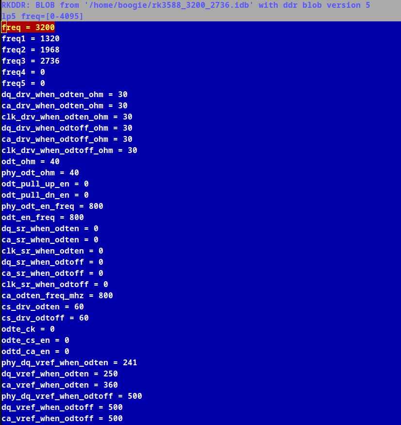

if you like what your are seeing here consider becoming a sponsor

https://github.com/sponsors/hbiyik

# rkddr

rkddr is a a DRAM configuration editor for rockchip based devices. To make use of the tool, simply run the `sudo rkddr` and navigate to the setting that the tui shows.
When finished save the configuration, *you do not have to do anything more, the tools automagically manages everything*, (no need to dd it back to the block device).




To verify that the new settings are in place, at least for the frequency settings.

```shell
cat /sys/class/devfreq/dmc/available_frequencies 
```

should give the new frequencies that you have configured.

# working with binary types

if no specific arguments provided, `rkddr` automatically finds the correct location where the DDR configuration is located and shows it at the header of the tui.

if you want to edit the ddr configuration in a specific block device you can also achieve if with

``` shell
sudo rkddr -d /dev/path-to-block-device (ie:sdc. or mtdblock1)
```

if you want to edit the ddr configuration an idblock on your filesystem (ie: u-boot artifacts)

``` shell
sudo rkddr -i path-to-idblock-file
```

if you want to edit the ddr configuration in raw ddr blob (ie: the ddr blobs provided by rockchip at https://github.com/rockchip-linux/rkbin/tree/master/bin/rk35)

``` shell
sudo rkddr -b path-to-raw-ddr-blob
```

whenever a change is made, a backup of your existing binary is backed up at folder `~/.rkddr/`, for future analysis or recovery

it is also beneficial to check out the help output in case of new features

``` shell
sudo rkddr -h

usage: PROG [options]

options:
  -h, --help           show this help message and exit
  -d, --device DEVICE  Work on on the DDR blob inside the found IDB of the given block device
  -i, --idb IDB        Work on on the DDR blob inside the given IDB file
  -b, --blob BLOB      Work on on the DDR blob file given
```

# what are TPL, IDB, DDR Blobs?

When Rockchip is booting, the chip searches a specific format called `idblock` or `IDB` for short as specific sector (64 (0x40)) each storage medium.

You can consider idblock as a zip or tar file containing 2 files. 1st is `TPL (tertiary boot loader)` 2nd is the `SPL (secondary boot loader)`.

So overall simplified boot process is as below:

`Bootrom (the chip) -> Idblock@64[First TPL -> Then SPL] -> U-boot@32768 -> Kernel and Linux/Android@partition``

In rockchip the first code executed by the CHIP inside the idblock, is TPL. And and this particular TPL is provided by rockchip as closed source, responsible of configuring the DDR memory. That TPL binary is also referred as DDR blob.

It is very beneficial to look at this page for details: https://opensource.rock-chips.com/wiki_Boot_option

# Real World results

Since rockchip deals with a lot of OEMs, their blobs are not always tuned up to the spec which is solder as a DRAM chip on the board.

I have noticed that all DDR5 rk3588 boards are tuned with under-frequency, and some rk3528 board are severely capped. So be my guest on trying to find out more.

One thing to note is how dmc governor works on rockchip bsp kernel. When first DDR blob is initialized, it trains the given frequency, and 5 alternative ones.

Once it is trained with the main fequency, it passes those frequencies to kernel. At this point kernel has 2 frequency source, first is what DDR blob provides, 2nd is what is available in the dts.

What kernel does in this case is to iterate each frequency given by the blob, and fetches the voltage from from the DTS which has dts_frequency >= blob_freqency.

So dts dmc opp table is only a lookup table for the voltages. In some cases dts max frequency may not be enough for the blob frequency that the board can achieve, in this case to achieve higher frequncies maximum frequncy in the dts needs to be bumped. ie: https://github.com/hbiyik/linux/commit/c277791c584a3b53b95006f2ddb3ed06d1021f70, this is to achieve ddr5-6400 frequencies in rk3588.

# Limitations

Currently only rk35xx boards are supported. It is technically possible to support earlier boards but i dont have any rk33xx so i dont want to blindly copy paste code.
Any PR is weelcome int hat regard, you can refer to ddr V0 structure here: https://github.com/rockchip-linux/rkbin/blob/f43a462e7a1429a9d407ae52b4745033034a6cf9/tools/ddrbin_tool.py#L218C1-L219C20  (the part with v0_info) 

# Warnings

This is not a bios, and there is no clear CMOS jumper or battery. Meaning that if you do somehting wrong, your board can freeze. In such a case, you can manually write your idblock in backups using `maskrom`. Additionally not likely but possibly, things you enter might physically damage your ahrdware. You should be taking this responsibility when using this tool.